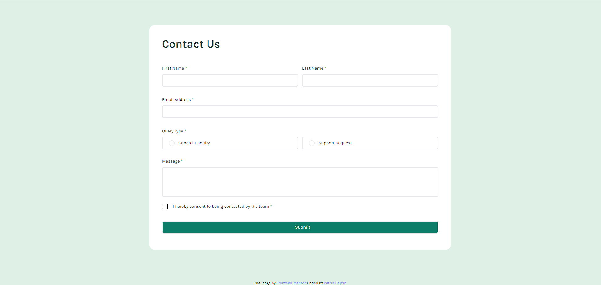

# Frontend Mentor - Contact form solution

This is a solution to the [Contact form challenge on Frontend Mentor](https://www.frontendmentor.io/challenges/contact-form--G-hYlqKJj). Frontend Mentor challenges help you improve your coding skills by building realistic projects. 

## Table of contents

- [Overview](#overview)
  - [The challenge](#the-challenge)
  - [Screenshot](#screenshot)
  - [Links](#links)
- [My process](#my-process)
  - [Built with](#built-with)
  - [What I learned](#what-i-learned)
  - [Continued development](#continued-development)
- [Author](#author)

## Overview

### The challenge

Users should be able to:

- Complete the form and see a success toast message upon successful submission
- Receive form validation messages if:
  - A required field has been missed
  - The email address is not formatted correctly
- Complete the form only using their keyboard
- Have inputs, error messages, and the success message announced on their screen reader
- View the optimal layout for the interface depending on their device's screen size
- See hover and focus states for all interactive elements on the page

### Screenshot

](./screenshot.png)

### Links

- Solution URL: [Add solution URL here](https://github.com/Patri22k/contact-form)
- Live Site URL: [Add live site URL here](https://your-live-site-url.com)

## My process

### Built with

- [HTML5](https://developer.mozilla.org/en-US/docs/Glossary/HTML5) - Semantic markup for structuring web content
- [CSS3](https://www.w3.org/Style/CSS/Overview.en.html) - Styling and layout
- [Vite](https://vitejs.dev/guide/) - Next Generation Frontend Tooling
- [Tailwind CSS](https://tailwindcss.com/) - Utility-first CSS framework
- [React](https://react.dev/) - JavaScript library for building user interfaces

### What I learned

In this project, I focused on enhancing the user interface with responsive design using CSS and the Tailwind CSS framework. I learned to create responsive layouts without relying on additional libraries, ensuring a seamless experience across different devices. Additionally, I implemented contact forms using React, which allowed for efficient state management and dynamic updates, providing a smooth and interactive user experience.

### Continued development

#### Improving Responsive Design Skills
While I have learned the basics of creating responsive designs with CSS and Tailwind CSS, I recognize that there is still much to master in this area. I aim to deepen my understanding of responsive design principles, explore advanced techniques, and practice creating more complex and adaptive layouts.

## Author

- Github - [Patrik Bajzík](https://github.com/Patri22k)
- Frontend Mentor - [@Patri22k](https://www.frontendmentor.io/profile/Patri22k)
- Gmail - bajzik.patrik6@gmail.com